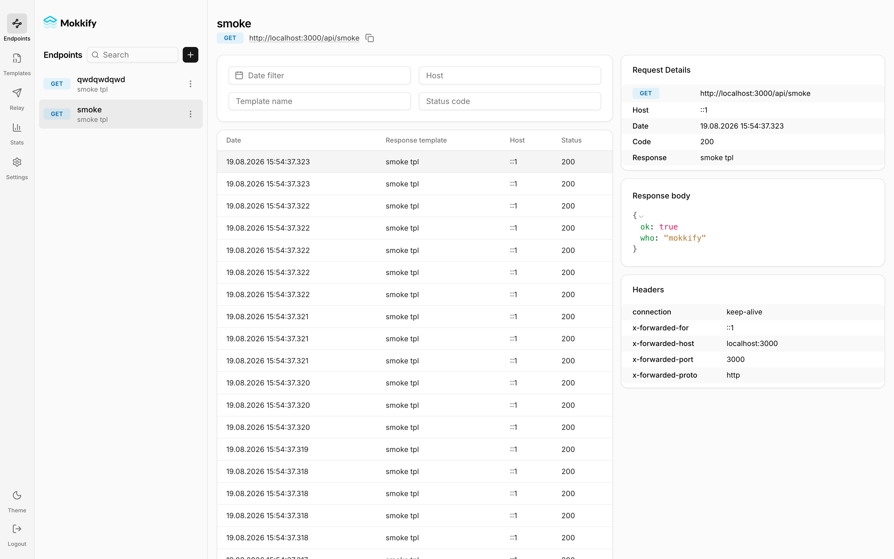
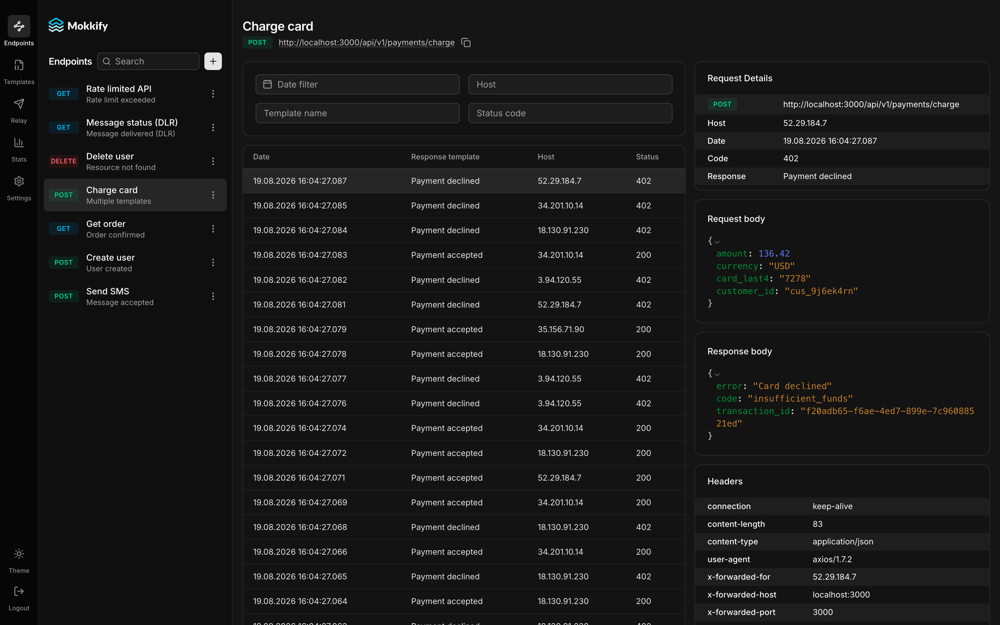

[](https://opensource.org/licenses/MIT)


# Mokkify

Welcome to **Mokkify** - a self-hosted RestAPI mocking service built with Next.js. Mokkify provides a flexible response builder and templating system for crafting your mocks, as well as support for Relay requests to an external hook to simulate various scenarios, like DLR. We've done our best to make the interface intuitive and easy to use.

[Demo](https://demo.mokkify.dev) admin / admin

## Features

- 🔁 RestAPI mocking
- 🏗️ Self-hosted
- ⚡ In-memory endpoint caching and batched log writes. 2,500+ rps on a single node
- 🧭 Path parameters and wildcards: `/users/:id`, `/files/*`
- 🧩 Flexible response builder and templates with variables
- 🎛️ Custom response headers and content types (JSON, XML, plain text, HTML, CSV)
- 🌐 CORS out of the box (preflight, custom headers, credentials)
- 📥 OpenAPI / Swagger import: generate endpoints from a spec
- ⏲️ Response delay emulation
- 🔄 Relay request support with external hooks
- 🔮 Intuitive interface with light & dark themes
- 🔐 Authorization
- 🤖 Agent-ready: API keys, a published OpenAPI contract, and a bundled MCP server
- 📈 Endpoint RPS graphics
- 🗄️ Dump and restore configuration





## Tech stack

Next.js 16 (Turbopack) · React 19 · Tailwind CSS 4 + shadcn/ui · Sequelize + SQLite (WAL)

## Requirements

- Node.js >= 20.17
- pnpm 10
- SQLite3

## Installation & Running

First, clone the repository:

```bash
git clone https://github.com/Wavix/Mokkify.git
```

Then, navigate to the project directory and install the necessary dependencies:

```bash
cd Mokkify
pnpm install
pnpm cli dbcreate
pnpm cli useradd <login> <password>
```

After that, start the project in development mode:

```bash
pnpm dev
```

Or build and run the production server:

```bash
pnpm build
pnpm start
```

Open [http://localhost:3000](http://localhost:3000) with your browser to see the result.

## Template variables

Response templates (and relay payloads) support variables that are resolved per request:

| Variable                | Value                                                                   |
| ----------------------- | ----------------------------------------------------------------------- |
| `@uuid`                 | Random UUID v4                                                          |
| `@date`                 | Current date/time (ISO 8601)                                            |
| `@dateYYYYMMDD`         | Current date as `YYYYMMDD`                                              |
| `@unix`                 | Current unix timestamp                                                  |
| `@request.field.nested` | Value from the request body or query string                             |
| `@response.field`       | Value from the mock response body (relay payloads)                      |
| `@path.param`           | Path parameter value (`/users/:param`); wildcard tail: `@path.wildcard` |

## Configuration

Environment variables (all optional):

| Variable              | Default                          | Description                                                                                                                                |
| --------------------- | -------------------------------- | ------------------------------------------------------------------------------------------------------------------------------------------ |
| `JWT_SECRET`          | built-in dev secret              | Secret used to sign auth tokens. **Set your own in production.**                                                                           |
| `DATABASE_PATH`       | `database.sqlite`                | Path to the SQLite database file (mount a volume here in Docker).                                                                          |
| `LOG_RETENTION_DAYS`  | `30`                             | Request logs older than this are purged hourly. `0` disables the purge.                                                                    |
| `MOKKIFY_SELF_ORIGIN` | `http://127.0.0.1:${PORT:-3000}` | Loopback origin the verify endpoint uses for its internal self-call. Override only if the app can't reach its own `/api/*` on the default. |

A `GET /health` endpoint (no auth) reports service and database status for load balancers and container healthchecks.

## Agent & API access

Beyond the browser UI, Mokkify exposes a machine-facing surface so agents (or any client) can configure and test mocks programmatically, without clicking through webhooks by hand.

### API keys

`/backend/*` is protected. In addition to the UI's JWT session, you can mint long-lived **API keys**:

- Create one in the UI (**Settings → API Keys**) or via `POST /backend/api-key` with a JWT.
- The key is returned **once** as `<key_id>.<secret>` — only a bcrypt hash of the secret is stored, so copy it immediately.
- Send it as `Authorization: Bearer <key_id>.<secret>` on every request. Revoke or deactivate keys from the same screen.

### OpenAPI contract

`GET /openapi` serves the full OpenAPI 3.1 contract (no auth) describing every `/backend/*` operation. Point Swagger UI, code generators, or an agent's tool loader at it.

### Composite create + verify

Two operations cover the whole "make a mock, then prove it works" loop:

- `POST /backend/mock` — atomically creates the response template and its endpoint in one call.
- `POST /backend/mock/{endpointId}/verify` — fires the mock server-side and returns its synchronous response **plus the correlated log row** for that exact request.

### MCP server

`mcp/` is a stdio MCP server that fetches the OpenAPI contract at startup and generates one tool per `/backend/*` operation — no hand-written tools. Register it with an MCP client (Claude Desktop / Claude Code) and an agent can drive Mokkify directly.

Build it first (`dist/` and `node_modules/` are gitignored):

```bash
cd mcp
pnpm install
pnpm build          # -> mcp/dist/index.js
```

Register over stdio, pointing at a running Mokkify and an API key:

```jsonc
{
  "mcpServers": {
    "mokkify": {
      "command": "node",
      "args": ["/absolute/path/to/mokkify/mcp/dist/index.js"],
      "env": {
        "MOKKIFY_BASE_URL": "http://localhost:3000",
        "MOKKIFY_API_KEY": "<key_id>.<secret>"
      }
    }
  }
}
```

In Claude Code, the one-liner:

```bash
claude mcp add mokkify \
  --env MOKKIFY_BASE_URL=http://localhost:3000 \
  --env MOKKIFY_API_KEY=<key_id>.<secret> \
  -- node /absolute/path/to/mokkify/mcp/dist/index.js
```

On startup the server logs which spec source it used (`remote:` when Mokkify is reachable, otherwise a fallback to the bundled `public/openapi.yaml`) and how many tools it registered. Bumped Mokkify to a version with new endpoints? Just restart the MCP server — tools regenerate from the fresh spec. See [`mcp/README.md`](mcp/README.md) for the full reference.

### Example: migrate a project's integrations to mocks

The point of the MCP server is to skip wiring webhooks by hand. Once it's registered, ask the agent to replace a project's external integrations with Mokkify mocks. The MCP handles the Mokkify side (`createMock` + `verifyMock`); the agent uses its own file tools for the rest.

A prompt like:

> Scan this project for outbound HTTP integrations. For each one, use the `mokkify` MCP to create a mock returning a realistic response, giving every integration its own path prefix. Then repoint each integration's base URL at Mokkify and run the integration tests.

drives roughly this flow:

1. **Discover** — the agent reads your code to find outbound calls (URL, method, expected response). _(agent, not MCP)_
2. **Create mocks** — one `createMock` per integration, namespaced by a path prefix so they don't collide, e.g. Stripe's `POST https://api.stripe.com/v1/charges` becomes a mock at `POST /stripe/v1/charges`. _(MCP)_
3. **Verify** — `verifyMock` fires each mock and confirms the response + correlated log. _(MCP)_
4. **Repoint** — the agent edits your config/env so each integration's base URL targets `http://localhost:3000/api/<prefix>` (e.g. Stripe base URL → `http://localhost:3000/api/stripe`). _(agent, not MCP)_
5. **Run** — the agent runs your integration tests against the mocks. _(agent)_

What to keep in mind:

- Response bodies are only as accurate as what the agent can infer from your code — feed it real examples (captured responses, provider OpenAPI, VCR cassettes) where the shape isn't obvious.
- Templates resolve request-derived variables (`@request.field`, `@path.param`, `@uuid`), but conditional/stateful behavior needs one mock per branch — the agent should split those out.
- `verifyMock` proves the mock responds; whether your project works against it is what step 5 checks.

## Nginx config for deployment

Response compression is intentionally disabled in the app server (`compress: false`) - enable gzip in nginx instead.

```
upstream webhook {
  server 127.0.0.1:3000;
}

location / {
    proxy_set_header Host <Your host>;
    proxy_set_header X-Forwarded-Proto $scheme;
    proxy_set_header X-Real-IP $remote_addr;
    proxy_set_header X-Forwarded-For $proxy_add_x_forwarded_for;
    proxy_pass http://webhook;
  }
```

## Support and Contributions

If you encounter any issues or have questions about using Mokkify, please create an "Issue" in this repository, and we'll be glad to assist you.

If you wish to contribute to the project's development, feel free to fork the repository and submit pull requests.

## License

This project is licensed under the MIT License - see the [LICENSE](LICENSE) file for more information.
